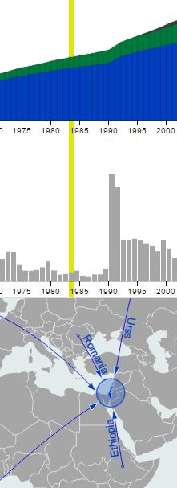

Example of the integration of two histogram charts with a map.

I used the statistical data from israeli 
<a href="http://www1.cbs.gov.il/reader/?MIval=cw_usr_view_Folder&ID=141" target="_blank" >Cental Bureau of Statistics</a>
The diagram shows the trend of population and immigration in Israel in the last few decades.

d3.js is used to generate both map and chart.
Topojson file is generated using data from  <a href="http://www.naturalearthdata.com/target="_blank" >  Natural Earth Data</a>

<a href="https://rawgit.com/pafavero/chart-map/master/chart%26map.html" target="_blank" title="Show preview"  >Show preview</a>
